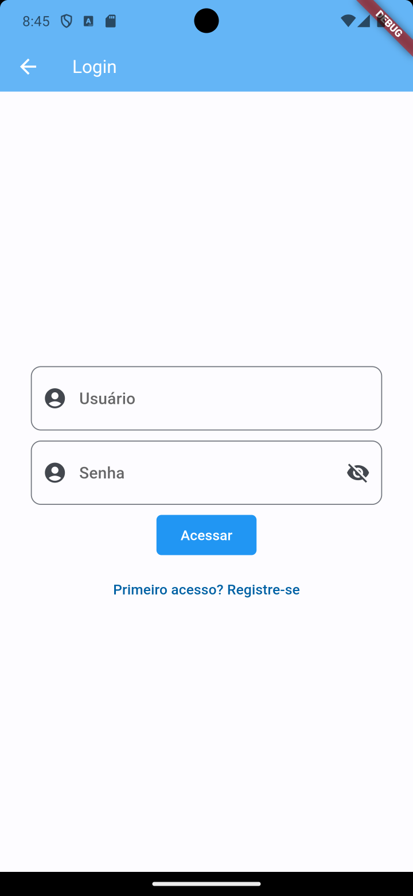
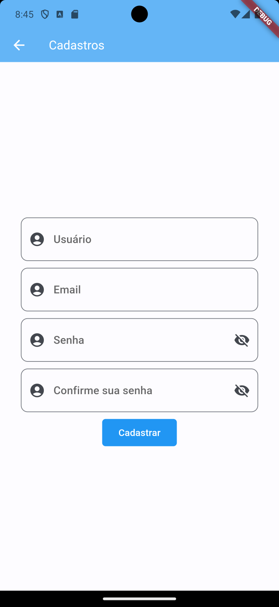
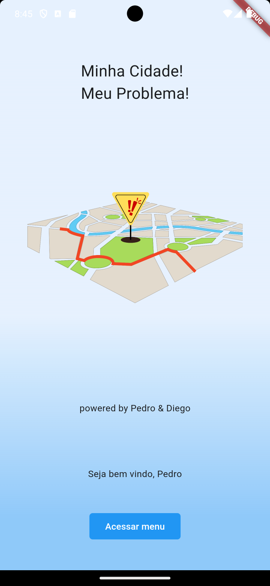
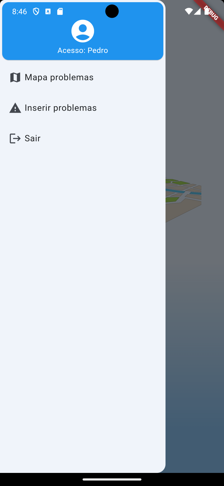
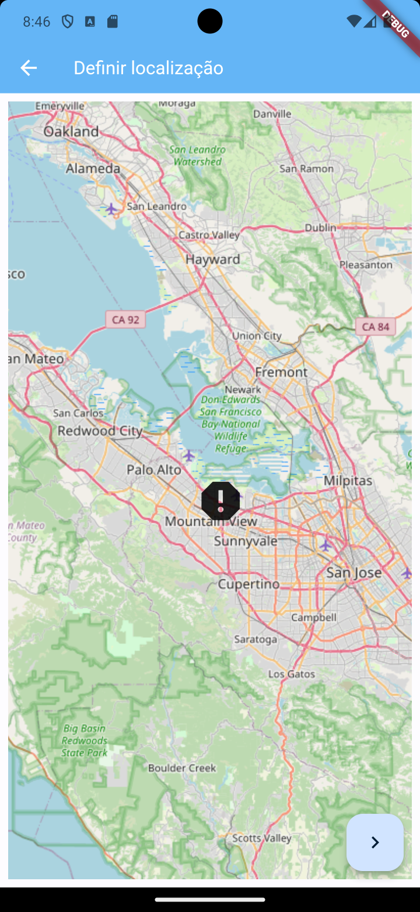
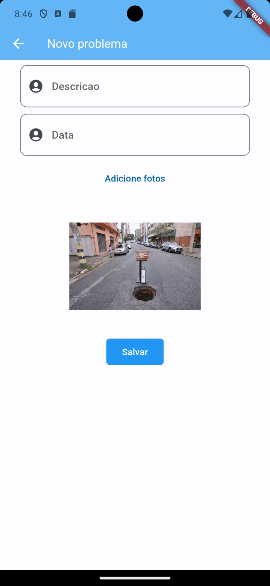
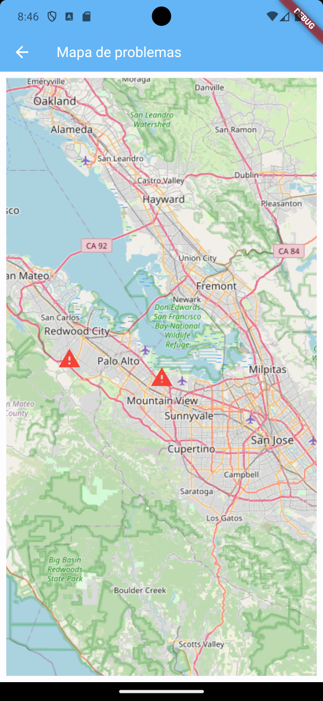
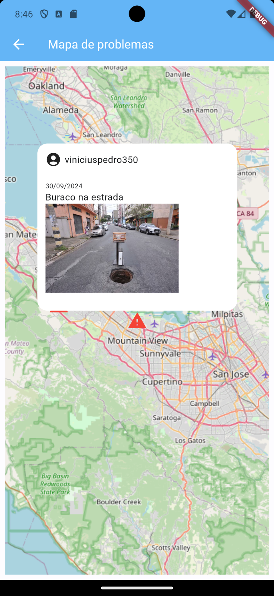

# Minha cidade, meu problema

Aplicativo desenvolvido para os cidadãos demonstrarem os problemas nas suas cidades, desde a falta de iluminação publica a acumulo de lixos em determinados lugares.

## Ações Desenvolvidades

O sistema hoje permiti o cadastro de denúncias locais que fica salvo no Sqllite no próprio celular. Você precisa informar uma descrição, a imagem e o dia para realizar a denúncia. Para realizar login, necessário nome e e-mail para cadastro.

A senha utiliza Sha256 para armazenar no banco.

## Melhorias

1. Integração com API para armazenar dados fora do aplicativo.
2. Permitir tirar diversas fotos para evidenciar os problemas.
3. Criar tipos de problemas (Iluminação, infraestrutura, estrada e etc.)
4. Comunicar autoridades locais e específicas dependendo do tipo de problema.
5. Acompanhamento da sua denuncia.
6. Avaliar e curtir outras denuncias, assim aumentando sua prioridade.

## Dependências

[Flutter Map](https://pub.dev/packages/flutter_map) - Para criação e manipulação do mapa

[Flutter Map Popup](https://pub.dev/packages/flutter_map_marker_popup) - Para visualização de um ponto no mapa

[Geolocator](https://pub.dev/packages/geolocator) - Para obtenção da localização do usuário

[Flutter Map](https://pub.dev/packages/get_it) - Para gerenciamento de estado

## Contribuição

Solicitações pull são bem-vindas. Para mudanças importantes, abra um problema primeiro
para discutir o que você gostaria de mudar.

Certifique-se de atualizar os testes conforme apropriado.

## Licença

[Licença](LICENSE)
